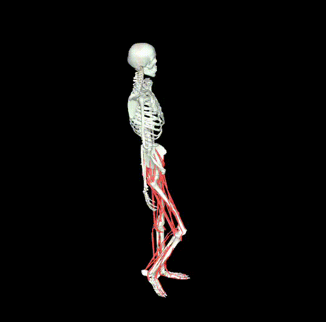

# Topics in Computer Graphics: Human Motion - Spring 2025

This repository contains the skeleton code for Assignment #3 of the SNU Human Motion course.  
It is based on the [myoLegWalk-v0](https://github.com/MyoHub/myosuite) environment from MyoSuite, and demonstrates training using PPO from [Stable-Baselines3](https://stable-baselines3.readthedocs.io/en/master/).


## Installation

We have tested this code on Ubuntu 22.04. (If you need to run this on Mac, you should use mjpython instead of python).

```bash
# Create a virtual environment
cd {project_folder}
python3.10 -m venv venv
source ./venv/bin/activate

# Install dependencies
pip install "stable_baselines3[extra]>=2.0.0a9"
pip install "myosuite"
```

## Training

Train a controller using Deep Reinforcement Learning (PPO).  
The trained model will be saved in the `checkpoints/` folder as a `.zip` file.

```bash
# Add --motion {motion_path} to train with reference motion
# Use --mode flat to set the task whether walk or stand
python learning.py --motion {motion_path} --mode walk/stand
```

### Hyperparameters

You can modify hyperparameters for PPO  under `policy_kwargs` in `learning.py`(Refer to the Stable-Baselines3 PPO documentation (https://stable-baselines3.readthedocs.io/en/master/modules/ppo.html) for available options).

## Rendering

Simulate the trained model.

```bash
# --model: path to the trained model
# Use --motion if motion data is needed
python rendering.py --model {model_path} --mode walk/stand (--motion {motion_path})
```

## Logging

Training logs are saved in the `logs/` directory. You can visualize them with TensorBoard:

```bash
tensorboard --logdir=logs
```

## Environment Descriptions (MyoLegWalk)

<!--  { width=10px } -->


### Action Space (R^80)

The action space is 80-dimensional (R^80) and controls muscle activation. Each value is clipped between 0 and 1 when passed to self.env.step(action).


| #  | Acronym       | Muscle                         |
|----|---------------|--------------------------------|
| 1  | addbrev_r     | Adductor brevis                |
| 2  | addlong_r     | Adductor longus                |
| 3  | addmagDist_r  | Adductor magnus (distal)       |
| 4  | addmagIsch_r  | Adductor magnus (ischial)      |
| 5  | addmagMid_r   | Adductor magnus (middle)       |
| 6  | addmagProx_r  | Adductor magnus (proximal)     |
| 7  | bflh_r        | Biceps femoris long head       |
| 8  | bfsh_r        | Biceps femoris short head      |
| 9  | edl_r         | Extensor digitorum longusc     |
| 10 | ehl_r         | Extensor hallucis longusc      |
| 11 | fdl_r         | Flexor digitorum longus        |
| 12 | fhl_r         | Flexor hallucis longus         |
| 13 | gaslat_r      | Gastrocnemius lateral head     |
| 14 | gasmed_r      | Gastrocnemius medial head      |
| 15 | glmax1_r      | Gluteus maximus (superior)     |
| 16 | glmax2_r      | Gluteus maximus (middle)       |
| 17 | glmax3_r      | Gluteus maximus (inferior)     |
| 18 | glmed1_r      | Gluteus medius (anterior)      |
| 19 | glmed2_r      | Gluteus medius (middle)        |
| 20 | glmed3_r      | Gluteus medius (posterior)     |
| 21 | glmin1_r      | Gluteus minimus (anterior)     |
| 22 | glmin2_r      | Gluteus minimus (middle)       |
| 23 | glmin3_r      | Gluteus minimus (posterior)    |
| 24 | grac_r        | Gracilis                       |
| 25 | iliacus_r     | Iliacus                        |
| 26 | perbrev_r     | Peroneus brevis                |
| 27 | perlong_r     | Peroneus longus                |
| 28 | piri_r        | Piriformis                     |
| 29 | psoas_r       | Psoas                          |
| 30 | recfem_r      | Rectus femoris                 |
| 31 | sart_r        | Sartorius                      |
| 32 | semimem_r     | Semimembranosus                |
| 33 | semiten_r     | Semitendinosus                 |
| 34 | soleus_r      | Soleus                         |
| 35 | tfl_r         | Tensor fascia latae            |
| 36 | tibant_r      | Tibialis anterior              |
| 37 | tibpost_r     | Tibialis posterior             |
| 38 | vasint_r      | Vastus intermedius             |
| 39 | vaslat_r      | Vastus lateralis               |
| 40 | vasmed_r      | Vastus medialis                |
| 41 | addbrev_l     | Adductor brevis                |
| ...| ...           | ...                            |
| 80 | vasmed_l      | Vastus medialis                |


### Observation Dictionary (obs_dict)

This environment differs from others as it provides a rich `obs_dict` containing various information. This dictionary includes:

- `time`: Simulation time
- `qpos_without_xy`: Height and joint angles
- `qvel`: Velocity of the character
- `com_vel`: Velocity of the center of mass
- `torso_angle`: Angle of the upper body
- ...
- `act`: Current muscle activation levels

You can select desired values from this `obs_dict` to construct your own observation space or design rewards. 
*** You are also allowed to use other values such as qpos and qvel for observation or reward ***

### Skeleton Information (https://github.com/MyoHub/myo_sim/blob/main/leg/assets/myolegs_chain.xml)

Indices corresponding to qpos 

| Index Range | Description |
|------------|-------------|
| **0:3** | **Root position (x, y, z)** |
| **3:7** | **Root orientation (quaternion)** |
| **7** | **Right hip flexion** |
| **8** | **Right hip adduction** |
| **9** | **Right hip rotation** |
| 10:12 | Knee micro-translations - negligible  |
| **12** | **Right knee flexion** |
| 13:15 | Knee micro-rotations - negligible |
| **15** | **Right ankle flexion** |
| 16:18 | Foot auxiliary joints - negligible  |
| 18:21 | Patella micro-movements - negligible |
| **21** | **Left hip flexion** |
| **22** | **Left hip adduction** |
| **23** | **Left hip rotation** |
| 24:26 | Knee micro-translations - negligible |
| **26** | **Left knee flexion** |
| 27:29 | Knee micro-rotations - negligible |
| **29** | **Left ankle flexion** |
| 30:32 | Foot auxiliary joints - negligible |
| 32:35 | Patella micro-movements - negligible |

### Reference Motion

Reference poses corresponding to the current time (self.t) are stored in self.target_pos and self.target_vel. You can uncomment the code at the bottom of custom_myoleg3d.py and run 'python3 custom_myoleg3d.py' to directly visualize the reference motion. Unlike the previous homework, this problem does not have a separate skeleton for the reference motion.

### More Details

For default termination conditions, obs_dict, or other specifications, please refer to: 
https://github.com/MyoHub/myosuite/blob/main/myosuite/envs/myo/myobase/walk_v0.py

### Customization

You can customize the Observation, Reward, and Termination Condition.  We recommend modifying the sections marked with `TODO`.*Note: You can modify any part as needed, as long as you don't directly modify the character's physical information.*

## Motion Data 

The motion data came from repository https://github.com/lsw9021/MASS.git.
